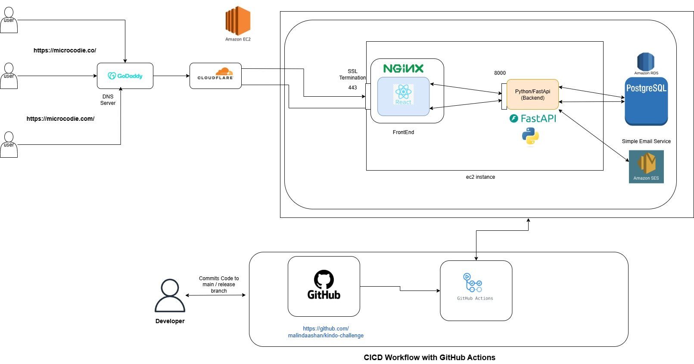

## Kindo Challenge

### Project Description

This project consist of two components which are
* Kindo-challenge-ui
* Kindochallengebackend

And this project enables the parents to register their children to school field trips. And make payments through their credit cards seamlessly.

### Prerequisites

* python version 3.9 or above
* node version 22 or above

### Configurations

Configuration are set in .env file for backend. please add your own configs before running the project.
(default dialect is postgres)

* SMTP_USER
* SMTP_PASS
* SMTP_HOST 
* SMTP_PORT 
* DB_USERNAME
* DB_PASSWORD
* DB_HOST
* DB_PORT

### Architecture

